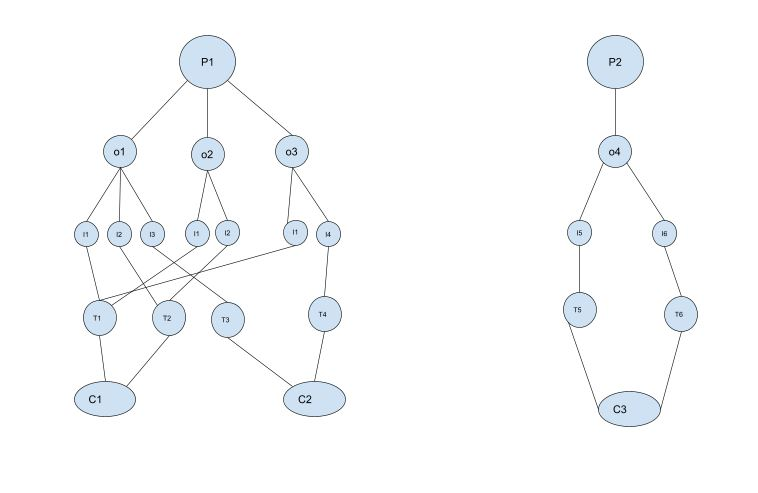

# Ecommerce Order Picking Service
The Project follows microservice architecture for developing a full Ecommerce Service, I have implemented order picking 
microservice.


## Project Problem Definition 

- You are part of a team that is planning to migrate a monolithic ecommerce platform from a legacy
database engine with an outdated schema to a more modern database engine
with an extensible schema and implement enhancements.

- At the same time, your team has decided to follow a microservice architecture where you can back the appropriate database domains with
Spring Boot based microservices (RESTful or otherwise).
  

- A modern ecommerce platform can have many sets of microservices: customer, order, product, inventory, payment, picking, shipping/delivery etc.

- Order picking is a process of finding products from warehouses or distribution centers to fulfill
customer orders and is associated along with packing and delivery in any order processing system.
  
## Architecture 


## DB Design / ER Diagram 


## Flow of my Project 

I have assumed a pickup as single or batch based on numbers of orders, all pickups with single orders are 
Single Pickups and else is Batch.

The left picture is for Batch Pickup and the right is for Single Pickup:



1. One pickup(P) can have many orders(O).
2. One Order(O) can have many items (I).
3. Multiple Items can be a part of single Tote(T).
4. Multiple Totes(T) can be a part of single Cart(C).
5. Multiple Carts(C) can be a part of a Pickup.


## API Endpoints Description 
- The description of the endpoints can be referred by running the project and going to following link :
    
```http://localhost:8080/api/swagger-ui/```

